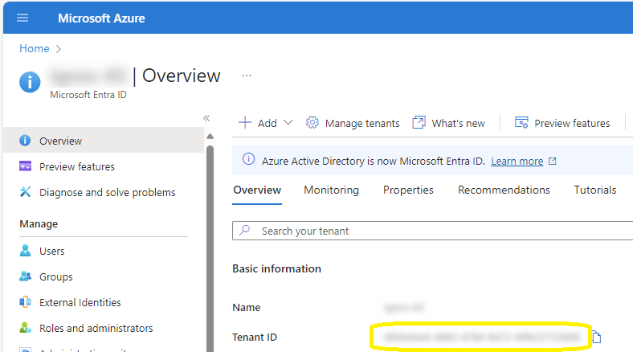

# IgnosKeepAgent
Ignos Keep local agent service for file transfer to and from CNC machines

## Service principal
If you do not already have a suitable service principal in Microsoft Entra ID for using the Ignos API, largely follow the instructions at [Register a service principal](https://docs.ignos.io/docs/integration/register-service-principal) to register one. In step 9 _Configure API permissions:_, instead of assigning the Integration role, assign the _Keep Agent_ role.

## Configuration

Configure the service principal information into `appsettings.json`:
```
"IgnosApi": {
        "TenantId": "",
        "ClientId": "",
        "ClientSecret": "",
    },
```

Leave the already configured items unchanged.
- In `TenantId`, configure your Microsoft Entra ID Tenant ID:


- Configure the service principal application (client) id and the generated client secret in `ClientId` and `ClientSecret`


## Installation
Install the agent as a service using this command line or similar
`sc.exe create "Ignos Keep Agent Service" start=auto binpath="path.to.agent.exe" obj="NT AUTHORITY\LocalService"`

If desirable, and local computer has access to shares, run as `obj="NT AUTHORITY\NetworkService"`

If you have a specific account to run the agent as, use `obj="DOMAIN\ACCOUNT" password="password"`
